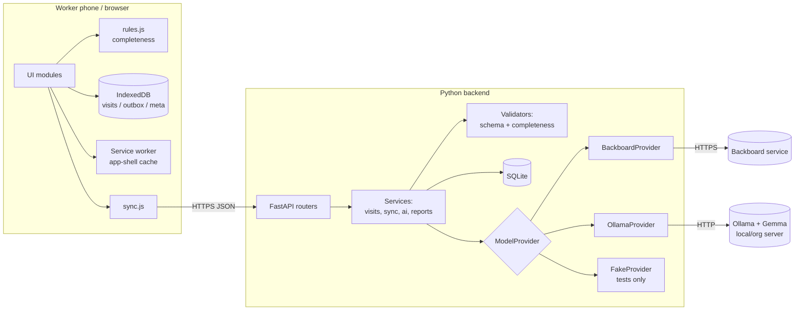

# FieldHealth AI — Technical Requirements Document (TRD)

| | |
|---|---|
| Project | FieldHealth AI |
| Document | 02 — Technical Requirements Document |
| Version | 0.1 |
| Status | Draft |
| Last updated | 2026-10-09 |
| Related | `01-product-requirements.md`, `03-application-flow.md`, `05-database-schema.md`, `06-implementation-plan.md` |

---

## 1. Technical overview and constraints

**Confirmed constraints:** lightweight JavaScript frontend; Python backend; SQLite; IndexedDB for on-device records; service worker for interface caching; UUIDs + revision checks + explicit conflict resolution; model adapters for Backboard (explicitly configured model) and local Gemma via Ollama.

**Design principles**
1. **Offline capture is independent of model availability.** The browser never calls a model; only the backend does.
2. **Server is the authority** for validation, revisions, confirmation, reporting.
3. **Model output is data to be validated, not trusted.**
4. **Simplest architecture that works:** one backend process serves API and static frontend; no queues, no ORM, no bundler.

## 2. Recommended stack (proposed unless stated)

| Layer | Choice | Status | Rationale / alternative |
|---|---|---|---|
| Frontend | HTML + CSS + ES modules (vanilla JS), no build step | Confirmed "lightweight JavaScript"; vanilla is a proposal | Alt: Preact + htm via CDN-free vendored file |
| Local storage | IndexedDB (small hand-written promise wrapper) | Confirmed | Alt: `idb` library vendored |
| Offline shell | Service worker, versioned cache | Confirmed | |
| Backend | Python 3.11+, **FastAPI** + Pydantic v2, Uvicorn | Proposed (A-1) | Alt: Flask + jsonschema |
| Database | SQLite (WAL mode), stdlib `sqlite3`, SQL migrations | Confirmed SQLite; access layer proposed | Alt: SQLAlchemy Core |
| HTTP client (model calls) | `httpx` with timeouts | Proposed | |
| Password hashing | `hashlib.scrypt` (stdlib) | Proposed | Alt: argon2-cffi |
| Tests | `pytest`, `pytest-asyncio`/`httpx` test client; Playwright for the offline E2E | Proposed | |
| Hosting | Single process behind HTTPS reverse proxy (e.g., Caddy/Nginx) or localhost for demo | **Unconfirmed** — author records actual deployment after the demo | Service workers require HTTPS except on `localhost` |

## 3. Architecture



The browser talks only to the FastAPI app. Provider credentials exist only in the server environment.

## 4. Modules and responsibilities

### Backend (`backend/app/`)
| Module | Responsibility |
|---|---|
| `main.py` | App factory, routers, static mount, security headers |
| `config.py` | Typed settings from environment (see §11) |
| `db.py` | Connection handling (WAL, foreign keys ON), migration runner |
| `auth.py` | Login, sessions, CSRF token, role dependencies |
| `models/` | Pydantic request/response models, enums |
| `rules.py` | Deterministic completeness engine (authoritative) |
| `visits.py` | Upsert with revision check, idempotent ops, listing |
| `conflicts.py` | Conflict record creation and resolution bookkeeping |
| `ai/provider.py` | `ModelProvider` protocol, result/error types |
| `ai/ollama.py`, `ai/backboard.py`, `ai/fake.py` | Adapters |
| `ai/prompt.py` | Prompt text, `prompt_version`, JSON schema (`schema_version`) |
| `ai/validate.py` | Strict output validation, grounding check |
| `ai/service.py` | Orchestrates draft creation, logging to `model_runs` |
| `followups.py`, `dashboard.py`, `exports.py`, `evidence.py` | Feature routers |
| `audit.py` | Audit log writer |
| `cli.py` | `create-user`, `seed-synthetic`, `migrate`, `eval-run` |

### Frontend (`public/`)
| Module | Responsibility |
|---|---|
| `index.html`, `manifest.webmanifest`, `sw.js` | Shell, install metadata, offline cache |
| `app.js`, `styles.css` | Hash router, view lifecycle, responsive interface, and field workflows |
| `js/db.js` | IndexedDB access: `visits`, `outbox`, `aiDrafts`, `meta` |
| `js/sync.js` | Outbox drain, conflict capture, backoff, online/offline events |
| `js/api.js` | `fetch` wrapper (CSRF, error mapping) |
| `js/rules.js` | Client mirror of completeness rules (advisory) |
| `js/views/*.js` | One module per screen (see `03-application-flow.md`) |
| `js/ui/*.js` | Status chip, dialogs, field components |
| `shared/completeness_fixtures.json` | Cases run against both `rules.js` and `rules.py` |

## 5. Offline and sync design

### 5.1 IndexedDB stores (database name `fieldhealth`, version 1)
| Store | Key | Contents |
|---|---|---|
| `visits` | `id` (UUID) | Full local visit document + `base_revision`, `sync_state` (`local_only`, `pending`, `synced`, `conflict`), `updated_local_at` |
| `outbox` | `op_id` (UUID) | `{op_id, visit_id, type:'upsert', payload, base_revision, created_at, attempts, last_error}` |
| `conflicts` | `conflict_id` | Server copy, local copy, detected time |
| `aiDrafts` | `visit_id` | Last fetched draft (read cache only) |
| `meta` | key | Schema version, last pull cursor, user snapshot |

Rules: write the visit **and** its outbox op in **one transaction**. Do not display "Saved on device" until `transaction.oncomplete`. Request persistent storage (`navigator.storage.persist()`) where available and surface the result in Settings.

### 5.2 Sync protocol
1. Drain outbox oldest first, one visit at a time (ops for the same visit are coalesced: only the newest payload is sent, using the earliest unsent `base_revision`).
2. `PUT /api/visits/{id}` body: `{client_op_id, base_revision, fields...}`.
3. Server logic (single SQLite transaction):
   - If `client_op_id` already in `client_ops` → return stored result (idempotent retry).
   - If visit does not exist → create at `revision = 1` (requires `base_revision = 0`).
   - If exists and `status = confirmed` → 409 `VISIT_LOCKED`.
   - If `base_revision != current revision` → create `sync_conflicts` row, return **409** `REVISION_CONFLICT` with the server copy. **No write.**
   - Else apply, `revision += 1`, record `client_ops`, return the new visit.
4. On 200 the client sets `base_revision` to the returned revision and clears the op.
5. On 409 the client stores the conflict, marks the visit `conflict`, and **stops syncing that visit** until resolved.
6. On network error, retry with exponential backoff (cap 5 min) and on `online` events.
7. Pull: `GET /api/visits?since=<cursor>` merges server changes for visits with no pending local op; for visits with a pending op, a changed server revision is treated as a conflict at push time (never merged silently).

### 5.3 Conflict resolution
Conflict UI compares **field by field** (`observation_notes`, `visit_date`, `household_code`, `water_source`, `people_present`, `followups`). The worker chooses mine / server / edited. Submitted as a normal `PUT` with `base_revision = server_revision` and `resolves_conflict_id`. Server marks the conflict resolved, stores `resolution` (`keep_mine`, `keep_server`, `merged`) and the payload.

### 5.4 Service worker
- Cache name `fh-shell-v{BUILD_ID}`; precache the shell file list generated at build/start (`/`, JS, CSS, manifest, icons).
- Navigation requests: network-first with cache fallback for the shell; **API requests are never cached** and never served from cache.
- On activate delete older caches; when a new worker is waiting, show a non-blocking "Update available" bar.
- No sensitive data is stored in Cache Storage.

## 6. API design

Conventions: JSON; ISO 8601 UTC timestamps; dates as `YYYY-MM-DD`; UUIDs lowercase; errors use `{ "error": { "code": "...", "message": "...", "details": {...} } }`; CSRF header `X-CSRF-Token` on non-GET.

| Method & path | Role | Purpose | Notes / errors |
|---|---|---|---|
| `POST /api/auth/login` | public | Sign in | 401 `INVALID_CREDENTIALS`; rate limited |
| `POST /api/auth/logout` | any | End session | |
| `GET /api/auth/me` | any | Current user + CSRF token | |
| `GET /api/health` | public | Liveness only | No config leakage |
| `PUT /api/visits/{id}` | worker | Idempotent upsert / resolve | 200, 409 `REVISION_CONFLICT`/`VISIT_LOCKED`, 422 |
| `GET /api/visits` | any | List/filter (`status,from,to,worker,q,since,cursor,limit`) | Worker limited to own |
| `GET /api/visits/{id}` | any | Detail | 403/404 |
| `POST /api/visits/{id}/ai-draft` | worker | Generate draft from server-stored notes | 200 draft; 409 if not synced/locked; 502 `MODEL_UNREACHABLE`; 504 `MODEL_TIMEOUT`; 422 `MODEL_OUTPUT_INVALID` (draft stored as failed) |
| `GET /api/visits/{id}/ai-draft/latest` | any (owner/supervisor) | Latest draft with validation info | |
| `POST /api/visits/{id}/confirm` | worker | Confirm with `base_revision` | 200; 409; 422 `INCOMPLETE` with `missing[]` |
| `GET /api/followups` | any | List (`status,due_before,visit_id`) | |
| `PATCH /api/followups/{id}` | any (own visit/supervisor) | Status change with `revision` | 409 on stale revision |
| `GET /api/dashboard/summary` | supervisor (worker: own) | Aggregates over confirmed | |
| `GET /api/exports/visits.csv` | supervisor | CSV | Audited |
| `GET /api/exports/visits.json` | supervisor | JSON | Audited |
| `GET /api/model/status` | any | Configured provider/model name, reachability check result, last success summary | Never returns keys or URLs with credentials |
| `GET /api/evidence/model-runs` | supervisor | Model-run log (JSON/CSV via `Accept`) | |

Visit payload (create/update): `visit_date`, `observation_notes`, `household_code|null`, `water_source|null`, `people_present[]`, `followups[]`. Server-owned fields (`revision`, `status`, `worker_id`, timestamps, provenance) are ignored if sent.

## 7. AI integration design

### 7.1 Provider interface
```python
class ModelProvider(Protocol):
    name: str               # "ollama" | "backboard" | "fake"
    model: str              # exactly as configured; never invented
    def extract(self, system_prompt: str, user_text: str, json_schema: dict, timeout_s: float) -> ProviderResult: ...
    def check_reachable(self, timeout_s: float) -> ReachabilityResult: ...
```
`ProviderResult` = `{raw_text, http_status, latency_ms}`; errors raise typed exceptions (`ProviderUnreachable`, `ProviderTimeout`, `ProviderError`). The service layer maps them to API error codes and `model_runs.outcome`.

### 7.2 Adapters
- **Ollama** (`AI_PROVIDER=ollama`): calls the local Ollama HTTP API (`OLLAMA_BASE_URL`, default `http://localhost:11434`) using the chat endpoint with a JSON-schema `format`, `stream=false`, temperature 0. Model tag from `OLLAMA_MODEL` (must be a Gemma tag the operator has pulled). `check_reachable` lists installed models and confirms the configured tag is present. *Implementation must verify request/response shapes against the installed Ollama version's documentation.*
- **Backboard** (`AI_PROVIDER=backboard`): requires `BACKBOARD_API_KEY`, `BACKBOARD_BASE_URL`, and an **explicit** `BACKBOARD_MODEL`; refuses to start the adapter if any is missing (no default model). *The exact Backboard request/response format and model eligibility are **unverified in this pack**; the implementer must read the provider's current documentation and record the verified details in `docs/evidence-and-writeup-template.md` before use.*
- **Fake** (`AI_PROVIDER=fake`, tests/dev only): returns fixtures; responses are labelled `provider="fake"` and the UI shows a "TEST PROVIDER — not model inference" badge. The Evidence screen excludes fake runs from "live inference" counts.

### 7.3 Prompt and schema
- `prompt_version` (e.g., `p1`) and `schema_version` (e.g., `s1`) are constants stored with each run.
- System prompt requirements: extract only what is stated; use `null` when not stated; do **not** diagnose, assess symptoms, or give treatment advice; output JSON only; include a short verbatim `evidence` snippet per non-null field.
- Output JSON Schema (`s1`), `additionalProperties: false` throughout:

```json
{
  "schema_version": "s1",
  "household_code": "string|null  (pattern from config)",
  "people_present": "null | [ { \"role\": \"string<=40\", \"age_group\": \"infant|child|adolescent|adult|older_adult|unspecified\", \"count\": \"int 1..30\" } ]  (empty array rejected)",
  "water_source": "null | piped|borehole|protected_well|unprotected_well|surface_water|rainwater|vendor_tanker|bottled_or_sachet|other|not_observed",
  "followups": "[ { \"kind\": \"revisit_household|supervisor_review|update_records|supply_or_admin_request|other_admin\", \"description\": \"string<=200\", \"due_date\": \"YYYY-MM-DD|null\" } ]  (empty array allowed = none stated)",
  "evidence": { "household_code": "string|null", "people_present": "string|null", "water_source": "string|null", "followups": "string|null" }
}
```

### 7.4 Validation pipeline (`ai/validate.py`)
1. Parse JSON (reject non-JSON; strip no code fences silently — fences are a validation failure, logged).
2. Schema validation (types, enums, lengths, patterns, no extra keys, no empty `people_present`).
3. Semantic checks: dates parse; `due_date ≥ visit_date`; count totals sane.
4. **Grounding check:** for each non-null field, `evidence[field]` must be a non-empty substring of the notes after case-folding and whitespace normalisation; otherwise the field is flagged `ungrounded` in the stored draft (value kept for transparency, but the review UI warns and defaults the action to *Ignore*).
5. On failure: draft `status=invalid`, errors stored, `model_runs.outcome=invalid_output`, visit unchanged.

### 7.5 Draft lifecycle
`POST ai-draft` → read notes from the **server copy** → call provider → validate → store `ai_drafts` row (`ready` or `invalid`/`failed`) + `model_runs` row → return. A draft records `visit_revision` (the revision whose notes were used); if notes change afterwards the UI marks the draft **stale**.

## 8. Authentication, roles, permissions

| Capability | field_worker | supervisor |
|---|---|---|
| Create/edit own draft visits | ✔ | ✘ |
| Request AI draft / confirm own visits | ✔ | ✘ |
| View own visits | ✔ | ✔ (all) |
| Dashboard | own only | all |
| Follow-up status change | own visits | all |
| Exports, evidence log | ✘ | ✔ |

Sessions: server-side `sessions` table, 256-bit random token stored hashed, cookie `fh_session` (`HttpOnly`, `SameSite=Lax`, `Secure` when `COOKIE_SECURE=true`), idle timeout configurable. Offline use after session expiry: the app remains usable for local capture with the cached user snapshot; sync resumes after re-login. Login attempts rate-limited per IP+username.

## 9. Validation, errors, logging, audit

- Pydantic models at every boundary; 422 responses list field paths.
- Uniform error envelope; no stack traces to clients.
- Structured JSON logs with `request_id`; never log notes text at INFO level, API keys, or cookies.
- `audit_log` rows for FR-021 events.
- Model runs: see FR-019; `raw_output` stored only if `STORE_RAW_MODEL_OUTPUT=true` (default `false`).

## 10. Security and privacy controls

- HTTPS outside localhost; HSTS via proxy.
- Security headers: `Content-Security-Policy` (self only; no inline script), `X-Content-Type-Options`, `Referrer-Policy: no-referrer`, `Frame-Options: DENY`.
- CSV formula-injection neutralisation: prefix `'` to cells starting with `= + - @ \t \r`.
- Output encoding: DOM built with `textContent`; no `innerHTML` with user or model text.
- Prompt-injection stance: notes are untrusted; model output is only parsed JSON validated against a schema — it is never executed or rendered as HTML, and it cannot trigger actions.
- SQL: parameterised statements only.
- Synthetic-data banner; no name/phone/address/GPS fields exist.
- Secrets only in environment variables (`.env` git-ignored; `.env.example` has placeholders).

## 11. Environments and configuration (placeholders only)

| Variable | Purpose | Example placeholder |
|---|---|---|
| `APP_ENV` | `dev`/`test`/`prod` | `dev` |
| `DATABASE_PATH` | SQLite file | `./data/fieldhealth.db` |
| `SESSION_SECRET` | CSRF/session signing | `change-me` |
| `COOKIE_SECURE` | Secure cookies | `false` (dev) / `true` (prod) |
| `HOUSEHOLD_CODE_PATTERN` | Regex | `^HH-[0-9]{4}$` |
| `AI_PROVIDER` | `ollama`/`backboard`/`fake`/`none` | `none` |
| `AI_TIMEOUT_SECONDS` | Provider timeout | `60` |
| `OLLAMA_BASE_URL` | Ollama endpoint | `http://localhost:11434` |
| `OLLAMA_MODEL` | Gemma tag installed locally | *(set by operator)* |
| `BACKBOARD_BASE_URL` | Provider endpoint | *(from provider docs)* |
| `BACKBOARD_API_KEY` | Secret | `<set-in-environment>` |
| `BACKBOARD_MODEL` | Explicit model identifier | *(set by operator)* |
| `STORE_RAW_MODEL_OUTPUT` | Keep raw output for evaluation | `false` |

`AI_PROVIDER=none` is valid: the app runs fully, AI features show "Model service not configured".

## 12. Performance, reliability, accessibility, devices

- Targets from NFR-007; SQLite indexes per schema doc; list endpoints paginated (default 50, max 200).
- SQLite WAL, `busy_timeout`, one writer; documented single-instance limit.
- Browsers: current Chrome/Edge/Firefox/Safari; primary target Android Chrome. IndexedDB and service worker support are required; unsupported browsers show an explicit warning rather than failing silently.
- Accessibility per NFR-003, tested with keyboard and a screen reader smoke pass.

## 13. Backup, migrations, deployment

- Migrations are ordered SQL files `migrations/0001_*.sql`, tracked in `schema_migrations`; no destructive migration without a backup step.
- Backup: `sqlite3 .backup` (or `VACUUM INTO`) nightly in deployments; restore procedure documented in the plan.
- Deployment: Uvicorn behind a TLS reverse proxy, or localhost for the demo. A **deployment verification record** (host, date, commit hash, HTTPS status, provider/model reachability result) is captured by TASK-037 and is author-supplied.

## 14. Test strategy

| Level | Coverage |
|---|---|
| Unit | rules (shared fixtures), schema validator (valid/invalid/edge), grounding check, CSV neutraliser, revision/idempotency logic, role checks |
| Adapter | Fake provider; HTTP mocking (`httpx.MockTransport`) for Ollama/Backboard request shape, timeouts, error mapping |
| API | Auth, upsert/conflict/locked, confirm gating, exports exclude drafts |
| E2E (Playwright) | Offline create → reload → persists; reconnect → syncs; two-context conflict → resolve; AI draft with fake provider → apply → confirm |
| Live (manual, recorded) | Real Ollama and/or Backboard call → `model_runs` row → evidence export |
| Eval | TASK-031 synthetic gold set; script outputs per-field accuracy **only when run** |

## 15. Technical risks and decisions

| ID | Decision / risk | Status |
|---|---|---|
| D-1 | FastAPI + stdlib sqlite3 | Proposed |
| D-2 | Confirmation online-only | Proposed (A-3) |
| D-3 | Synchronous AI endpoint (no job queue) | Proposed; revisit if timeouts hurt |
| D-4 | Coalesce outbox ops per visit | Proposed |
| R-1 | Backboard API shape and model eligibility unverified | Open — verify before implementing adapter |
| R-2 | Local Gemma performance on available hardware unknown | Open — measured and recorded by author |
| R-3 | iOS Safari storage eviction for installed/non-installed PWAs | Mitigated by sync prompts and persistence request; documented limitation |
