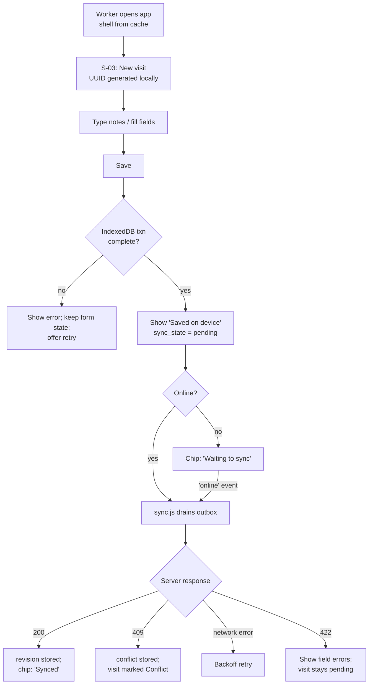
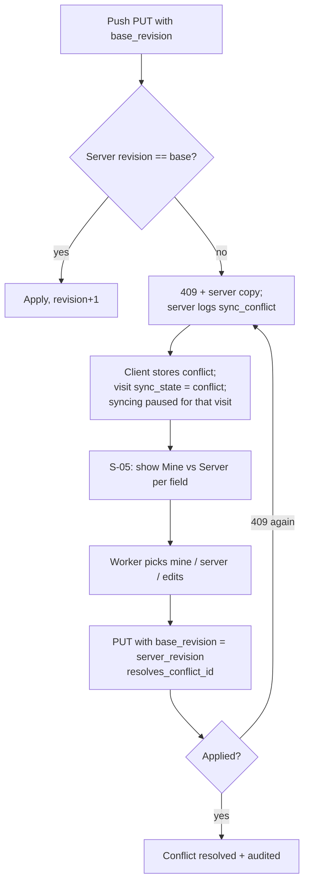

# FieldHealth AI — Application Flow

| | |
|---|---|
| Project | FieldHealth AI |
| Document | 03 — Application Flow |
| Version | 0.1 |
| Status | Draft |
| Last updated | 2026-10-09 |
| Related | `01-product-requirements.md` (FR/NFR IDs), `02-technical-requirements.md`, `04-design-brief.md` |

---

## 1. Actors

| Actor | Permissions summary |
|---|---|
| Field Worker (`field_worker`) | Capture, edit, sync, AI draft, review, confirm **own** visits; own follow-ups; own dashboard |
| Supervisor (`supervisor`) | Read all visits; follow-up status; dashboard; exports; model status and evidence log |
| System | Service worker, sync engine, completeness engine, model provider, audit logger |

## 2. Sitemap and screen inventory

| ID | Screen | Route | Roles | Requirements |
|---|---|---|---|---|
| S-01 | Sign in | `#/login` | public | FR-001 |
| S-02 | Home (Today) | `#/` | both | FR-004, FR-014 |
| S-03 | Visit editor | `#/visit/:id` | worker | FR-002, FR-003, FR-005 |
| S-04 | Sync centre | `#/sync` | both | FR-006, FR-007 |
| S-05 | Conflict resolver | `#/conflict/:id` | worker | FR-008 |
| S-06 | AI review | `#/visit/:id/review` | worker | FR-009–FR-012 |
| S-07 | Confirm dialog | modal on S-03/S-06 | worker | FR-013 |
| S-08 | Visit register | `#/register` | both | FR-014 |
| S-09 | Visit detail (read-only) | `#/visit/:id/view` | both | FR-013, FR-014 |
| S-10 | Follow-ups | `#/followups` | both | FR-015 |
| S-11 | Dashboard | `#/dashboard` | both (scope differs) | FR-016 |
| S-12 | Exports | `#/exports` | supervisor | FR-017, FR-018 |
| S-13 | Model status & evidence | `#/model` | both view status; supervisor evidence log | FR-019 |
| S-14 | Settings / About | `#/settings` | both | NFR-002, FR-020 |

Persistent chrome on every screen: **connectivity + sync status chip**, **"Fictional data — administrative reporting only"** notice (collapsible after first view, always reachable in S-14 and in the footer of exports), primary navigation (bottom bar on mobile, side rail on wide screens). Supervisor-only items are hidden for workers.

## 3. Primary journeys

### 3.1 Offline capture → sync (FR-002, FR-003, FR-006, NFR-001)



### 3.2 AI draft → review → confirm (FR-009 – FR-013)

```mermaid
sequenceDiagram
  actor W as Worker
  participant UI as Browser UI
  participant API as Backend
  participant M as Model provider
  W->>UI: Tap "Create AI draft" (visit synced, online)
  UI->>API: POST /visits/{id}/ai-draft
  API->>API: Read server copy of notes
  API->>M: extract(prompt, notes, schema)
  alt Provider unreachable / timeout
    M--xAPI: error
    API->>API: model_runs outcome = unreachable/timeout
    API-->>UI: 502/504 + message
    UI-->>W: "Model service unavailable. Your visit is saved. Try later."
  else Output invalid
    M-->>API: raw output
    API->>API: validate -> fail; store failed draft
    API-->>UI: 422 MODEL_OUTPUT_INVALID
    UI-->>W: "Draft could not be used. Fill fields manually or retry."
  else Valid
    M-->>API: JSON
    API->>API: validate, grounding check, store draft + model_runs
    API-->>UI: draft (ready)
    UI-->>W: S-06 side-by-side review
    W->>UI: Apply / Edit / Ignore per field
    UI->>UI: Update working fields locally (outbox op)
    W->>UI: Confirm
    UI->>API: POST /visits/{id}/confirm (base_revision)
    API->>API: completeness check + provenance
    API-->>UI: 200 confirmed (locked)
  end
```

### 3.3 Conflict (FR-007, FR-008)



### 3.4 Supervisor reporting (FR-014 – FR-019)
Sign in → Home shows counts of confirmed visits and overdue follow-ups → Register (filter) → Visit detail (view provenance, see which provider/model drafted) → Follow-ups (mark done) → Dashboard → Exports (CSV/JSON) → Model status (evidence log).

## 4. Alternate and failure paths

| Situation | Behaviour |
|---|---|
| App opened offline before first-ever load | Browser error (cannot be cached). Documented limitation; Settings explains "open once online". |
| Storage quota/ IndexedDB failure | Error banner with plain language; unsaved form content stays on screen; "Copy notes" action offered. |
| Session expired while offline | Local capture continues; sync paused with "Sign in to sync"; no data discarded. |
| Visit edited after an AI draft was made | Draft marked **Stale**; worker may regenerate; applying stale proposals requires an extra confirmation. |
| AI draft requested for an unsynced visit | Button explains "Sync first"; offers "Sync now". |
| Confirm with missing items | 422 `INCOMPLETE`; UI lists missing items and links to each field. |
| Confirm when visit is in conflict | Disabled until conflict resolved. |
| Model provider set to `none` | AI controls disabled with explanation; rest of app unchanged. |
| Provider returns fake/test badge | Review screen shows "TEST PROVIDER — not model inference". |
| Follow-up status change offline | Not available (A-4); control disabled with reason. |
| Worker tries to open another worker's visit | 403 → "Not available" screen. |

## 5. Navigation rules and redirects

- Unauthenticated → `#/login` (except when offline with a valid cached user snapshot: allowed into capture screens; sync paused).
- After login → `#/`.
- `confirmed` visit opened at `#/visit/:id` → redirect to `#/visit/:id/view`.
- Worker accessing `#/exports` → redirect to `#/` with message.
- Unknown route → Home.
- Browser back from editor with unsaved changes → prompt "Save on device?" (Save / Discard changes / Stay).

## 6. Screen behaviour

### S-01 Sign in
- **Elements:** username, password, "Sign in", fictional-data notice, offline hint.
- **Validation:** both required. **Errors:** invalid credentials (generic), rate-limit message, offline ("Connect once to sign in").
- **States:** loading spinner on submit; success redirect.

### S-02 Home (Today)
- **Worker:** "New visit" primary button; cards: *Needs attention* (incomplete drafts, conflicts, AI drafts ready), *Waiting to sync* count, *Recent visits* (own, last 10).
- **Supervisor:** summary tiles (confirmed today/this week, overdue follow-ups), links to Register/Dashboard.
- **States:** empty ("No visits yet. Tap New visit."), loading skeletons, offline banner.

### S-03 Visit editor
- **Visible:** visit date (default today), notes (multi-line, large), household code, water source (select), people present (repeatable rows: role, age group, count), follow-ups (repeatable rows: kind, description, due date), **completeness checklist**, sync/AI status, actions: Save, Create AI draft, Confirm, Discard draft (local-only visits).
- **Validation (inline, advisory until confirm):** household code pattern; count ≥ 1; due date ≥ visit date; description ≤ 200 chars with counter.
- **Behaviour:** autosave to IndexedDB after pause (debounced 1 s) and on blur; explicit Save also available; header shows "Saved on device HH:MM".
- **Permission:** read-only if `confirmed` or not owner.
- **Empty:** blank new visit. **Error:** save failure banner. **Loading:** none (local).

### S-04 Sync centre
- Lists outbox ops (visit, age, attempts, last error), conflicts, last successful sync time, button "Sync now".
- States: all synced; waiting; offline; auth required; error with details.

### S-05 Conflict resolver
- Table with rows per field: **Mine**, **Server**, **Result** (editable). Notes shown in full with a "Use both (append)" action.
- Shows who/when server version changed (device-agnostic: revision and server timestamp).
- Actions: "Apply my choices" (disabled until every differing field has a choice), "Cancel (stay in conflict)".
- Error: second conflict → refreshed comparison with a message.

### S-06 AI review
- Header: provider and model name from the draft record (or "TEST PROVIDER"), time, **Stale** badge if applicable.
- For each field (household code, people present, water source, follow-ups): left **AI proposal** (value or "Not found in notes"), right **Your value**, **Apply / Edit / Ignore**, evidence snippet with highlight in notes, **Ungrounded** warning where the snippet check failed (default action Ignore).
- Footer: completeness checklist, "Back to visit", "Confirm visit…".
- States: loading (request in flight with cancel), failure (reason + retry), invalid output (errors hidden by default, "Details" for supervisors/debug), no draft yet (CTA).

### S-07 Confirm dialog
- Summary of final values; list of missing items if any (then confirm disabled); statement "I have checked these fields." (checkbox); Confirm / Cancel.
- Online required; offline shows "Reconnect to confirm. Your visit is saved."

### S-08 Visit register
- Table/list: date, household code, worker (supervisor view), status (Draft/Confirmed), sync chip, completeness count, AI-draft state, follow-ups open.
- Filters: status, date range, worker, search by household code. Pagination 50.
- Local-only drafts are merged into the worker's list with a "Not yet synced" label.
- States: empty with filter hint; loading; offline (shows locally known data and labels it).

### S-09 Visit detail (read-only)
- Confirmed fields, notes, follow-ups, provenance per field, audit snippet, **drafted by**: provider/model **only if** a successful run exists (NFR-011).

### S-10 Follow-ups
- List with filters (open/done/cancelled, overdue), linked visit, due date. Action: Mark done / Cancel (online, revision-checked). States: empty, loading, offline disabled controls.

### S-11 Dashboard
- Date range filter. Tiles and charts per FR-016 (confirmed only). Worker sees own data only. Each chart has a text table alternative.

### S-12 Exports
- Choose date range → Download CSV / JSON. Shows column list, "Confirmed visits only", row count preview. Audit note. Error states for 403/empty set (empty set still produces a header-only file).

### S-13 Model status & evidence
- **All users:** configured provider and model identifier (as configured), reachability check button ("Check now" → result with time), last successful inference summary or "No successful inference recorded".
- **Supervisor:** table of `model_runs` with filters; export JSON/CSV; counts by outcome, excluding `fake` provider from "live" totals.

### S-14 Settings / About
- App version/build ID, storage persistence status, local data size, "Clear local data" (blocked while outbox non-empty), sign out, fictional-data and scope notice, link to documentation of limitations.

## 7. System-triggered flows

| Trigger | Action |
|---|---|
| `online` event / app focus | Start sync; refresh model status (non-blocking) |
| New service worker waiting | Show "Update available" bar; apply on user choice |
| Visit notes edited after draft | Mark draft stale |
| Confirm success | Audit entry; local copy refreshed; outbox cleared for visit |
| Export download | Audit entry with filters and row count |

## 8. Requirement coverage check

Every MVP FR appears above: FR-001 (S-01), 002/003 (S-03, 3.1), 004 (shell + chip), 005 (S-03), 006 (3.1, S-04), 007/008 (3.3, S-05), 009–012 (3.2, S-06), 013 (S-07), 014 (S-08), 015 (S-10, S-03), 016 (S-11), 017/018 (S-12), 019 (S-13), 020 (chrome, S-14), 021 (S-09, audit).
