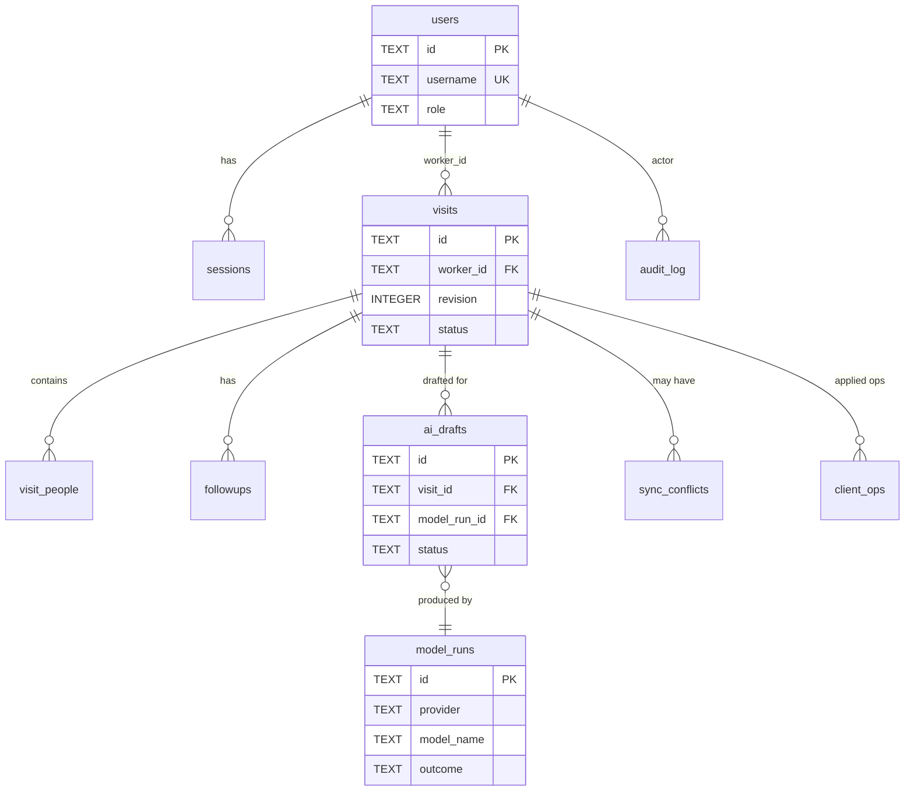

# FieldHealth AI — Database Schema

| | |
|---|---|
| Project | FieldHealth AI |
| Document | 05 — Database Schema |
| Version | 0.1 |
| Status | Draft |
| Last updated | 2026-10-09 |
| Related | `01-product-requirements.md`, `02-technical-requirements.md` (§5–§7), `03-application-flow.md` |

---

## 1. Database choice and rationale

**SQLite (server)** — confirmed. Single-instance prototype, simple backup, strong integrity features. Settings per connection: `PRAGMA foreign_keys=ON; PRAGMA journal_mode=WAL; PRAGMA busy_timeout=5000;`. Timestamps are UTC ISO-8601 text (`2026-10-09T20:35:00Z`); dates are `YYYY-MM-DD` text. UUIDs are lowercase text.

**IndexedDB (device)** is a *client-side working copy* described in TRD §5.1 — it is not a second source of truth: the server record wins after sync, and conflicts are resolved explicitly.

**Source-of-truth rule:** Visit **working/confirmed fields** live only in `visits`, `visit_people`, `followups`. Model proposals live only in `ai_drafts.proposed_json`. They never share columns.

## 2. Entity-relationship diagram

## 3. Tables

### 3.1 `users` (application-owned)
| Column | Type | Null | Default | Constraints / meaning |
|---|---|---|---|---|
| id | TEXT | no | | PK, UUID |
| username | TEXT | no | | UNIQUE, 3–40 chars, case-insensitive (store lowercase) |
| display_name | TEXT | no | | Fictional display name |
| role | TEXT | no | | CHECK IN ('field_worker','supervisor') |
| password_hash | TEXT | no | | scrypt hash string including parameters + salt |
| is_active | INTEGER | no | 1 | CHECK IN (0,1) |
| created_at | TEXT | no | now | |
| last_login_at | TEXT | yes | | |

### 3.2 `sessions`
| Column | Type | Null | Constraints / meaning |
|---|---|---|---|
| id | TEXT | no | PK, UUID |
| user_id | TEXT | no | FK → users.id ON DELETE CASCADE |
| token_hash | TEXT | no | UNIQUE; SHA-256 of random token |
| csrf_token | TEXT | no | Per-session CSRF token |
| created_at / expires_at / last_seen_at | TEXT | no | |

Index: `(user_id)`, `(expires_at)`.

### 3.3 `visits`
| Column | Type | Null | Default | Constraints / meaning |
|---|---|---|---|---|
| id | TEXT | no | | PK; **client-generated UUID** |
| worker_id | TEXT | no | | FK → users.id ON DELETE RESTRICT |
| revision | INTEGER | no | 1 | ≥ 1; incremented by each accepted write |
| status | TEXT | no | 'draft' | CHECK IN ('draft','confirmed') |
| visit_date | TEXT | no | | `YYYY-MM-DD` |
| observation_notes | TEXT | no | '' | Free text, ≤ 8,000 chars |
| household_code | TEXT | yes | | Pattern from config; checked in application layer |
| water_source | TEXT | yes | | CHECK IN (enum list §4) or NULL |
| provenance_json | TEXT | yes | | Set at confirmation; JSON object field → provenance enum |
| client_created_at | TEXT | yes | | Device clock at creation (informational) |
| created_at | TEXT | no | now | Server time first received |
| updated_at | TEXT | no | now | Last accepted write |
| confirmed_at | TEXT | yes | | Set with `confirmed_by` |
| confirmed_by | TEXT | yes | | FK → users.id |
| deleted_at | TEXT | yes | | Soft discard of unconfirmed visit |

Constraints: `CHECK ((status='confirmed') = (confirmed_at IS NOT NULL))`.
Indexes: `(worker_id, visit_date)`, `(status, visit_date)`, `(household_code)`, `(updated_at)` (sync cursor).

### 3.4 `visit_people`
| Column | Type | Null | Constraints / meaning |
|---|---|---|---|
| id | TEXT | no | PK, UUID (client-generated) |
| visit_id | TEXT | no | FK → visits.id ON DELETE CASCADE |
| role_label | TEXT | no | 1–40 chars; **no names** (BR-6) |
| age_group | TEXT | no | CHECK IN ('infant','child','adolescent','adult','older_adult','unspecified') |
| count | INTEGER | no | CHECK (count BETWEEN 1 AND 30) |
| position | INTEGER | no | Display order |

Index: `(visit_id)`.

### 3.5 `followups`
| Column | Type | Null | Default | Constraints / meaning |
|---|---|---|---|---|
| id | TEXT | no | | PK, UUID (client-generated) |
| visit_id | TEXT | no | | FK → visits.id ON DELETE CASCADE |
| kind | TEXT | no | | CHECK IN ('revisit_household','supervisor_review','update_records','supply_or_admin_request','other_admin') |
| description | TEXT | no | | 1–200 chars; administrative only |
| due_date | TEXT | yes | | `YYYY-MM-DD`; ≥ visit date (application check) |
| status | TEXT | no | 'open' | CHECK IN ('open','done','cancelled') |
| source | TEXT | no | 'worker' | CHECK IN ('worker','ai_applied') — whether the worker applied an AI proposal |
| revision | INTEGER | no | 1 | Incremented on status change |
| created_at / updated_at | TEXT | no | now | |
| completed_at | TEXT | yes | | |
| completed_by | TEXT | yes | | FK → users.id |

Indexes: `(status, due_date)`, `(visit_id)`.

### 3.6 `ai_drafts`
| Column | Type | Null | Constraints / meaning |
|---|---|---|---|
| id | TEXT | no | PK, UUID |
| visit_id | TEXT | no | FK → visits.id ON DELETE CASCADE |
| model_run_id | TEXT | no | FK → model_runs.id |
| visit_revision | INTEGER | no | Revision whose notes were sent |
| notes_sha256 | TEXT | no | SHA-256 of the notes text sent (used for stale detection) |
| status | TEXT | no | CHECK IN ('ready','invalid','failed') |
| proposed_json | TEXT | yes | Schema `s1` payload (only when valid) |
| field_flags_json | TEXT | yes | e.g. `{"water_source":"ungrounded"}` |
| validation_errors_json | TEXT | yes | List of `{path, message}` |
| created_by | TEXT | no | FK → users.id |
| created_at | TEXT | no | |

Index: `(visit_id, created_at DESC)`. "Latest draft" = max `created_at`. A draft is **stale** when `visits.revision > ai_drafts.visit_revision` **and** the notes changed (computed; see §6).

### 3.7 `model_runs` (inference evidence)
| Column | Type | Null | Constraints / meaning |
|---|---|---|---|
| id | TEXT | no | PK, UUID |
| visit_id | TEXT | yes | FK → visits.id ON DELETE SET NULL (also used for health checks → NULL) |
| kind | TEXT | no | CHECK IN ('extract','reachability_check') |
| provider | TEXT | no | CHECK IN ('ollama','backboard','fake') |
| model_name | TEXT | no | Exactly as configured/reported by the provider; never inferred |
| endpoint_label | TEXT | yes | Host only (no credentials, no path secrets) |
| prompt_version | TEXT | yes | e.g. `p1` |
| schema_version | TEXT | yes | e.g. `s1` |
| outcome | TEXT | no | CHECK IN ('success','unreachable','timeout','provider_error','invalid_output','not_configured') |
| http_status | INTEGER | yes | |
| latency_ms | INTEGER | yes | |
| input_char_count | INTEGER | yes | |
| output_char_count | INTEGER | yes | |
| output_sha256 | TEXT | yes | Hash of raw output |
| raw_output | TEXT | yes | Only if `STORE_RAW_MODEL_OUTPUT=true` |
| error_summary | TEXT | yes | Short, no secrets |
| started_at | TEXT | no | |

Indexes: `(started_at)`, `(provider, model_name, outcome)`.

### 3.8 `client_ops` (idempotency)
| Column | Type | Null | Constraints / meaning |
|---|---|---|---|
| op_id | TEXT | no | PK; client-generated UUID |
| user_id | TEXT | no | FK → users.id |
| visit_id | TEXT | no | FK → visits.id ON DELETE CASCADE |
| result_status | INTEGER | no | HTTP status returned |
| result_revision | INTEGER | yes | Revision after apply |
| received_at | TEXT | no | |

### 3.9 `sync_conflicts`
| Column | Type | Null | Constraints / meaning |
|---|---|---|---|
| id | TEXT | no | PK, UUID |
| visit_id | TEXT | no | FK → visits.id ON DELETE CASCADE |
| client_op_id | TEXT | no | Op that was rejected |
| base_revision | INTEGER | no | Client's base |
| server_revision | INTEGER | no | Server's revision at detection |
| client_payload_json | TEXT | no | What the client tried to write |
| server_payload_json | TEXT | no | Server copy at detection |
| detected_at | TEXT | no | |
| resolved_at | TEXT | yes | |
| resolved_by | TEXT | yes | FK → users.id |
| resolution | TEXT | yes | CHECK IN ('keep_mine','keep_server','merged') |
| resolution_payload_json | TEXT | yes | |

Index: `(visit_id, resolved_at)`.

### 3.10 `audit_log`
| Column | Type | Null | Meaning |
|---|---|---|---|
| id | INTEGER | no | PK AUTOINCREMENT |
| at | TEXT | no | |
| actor_user_id | TEXT | yes | FK → users.id (NULL for failed logins) |
| action | TEXT | no | `login`, `login_failed`, `confirm`, `conflict_resolved`, `export_csv`, `export_json`, `followup_status`, `evidence_export` |
| entity_type / entity_id | TEXT | yes | |
| detail_json | TEXT | yes | Filters, row counts — never notes text or secrets |

Index: `(at)`, `(action, at)`.

### 3.11 `schema_migrations`
`version TEXT PK`, `applied_at TEXT`.

## 4. Enumerations

| Name | Values |
|---|---|
| role | `field_worker`, `supervisor` |
| visit.status | `draft`, `confirmed` |
| water_source | `piped`, `borehole`, `protected_well`, `unprotected_well`, `surface_water`, `rainwater`, `vendor_tanker`, `bottled_or_sachet`, `other`, `not_observed` |
| age_group | `infant`, `child`, `adolescent`, `adult`, `older_adult`, `unspecified` |
| followup.kind | `revisit_household`, `supervisor_review`, `update_records`, `supply_or_admin_request`, `other_admin` |
| followup.status | `open`, `done`, `cancelled` |
| provenance | `worker_entered`, `ai_unchanged`, `ai_edited`, `ai_ignored` |
| ai_drafts.status | `ready`, `invalid`, `failed` |
| model_runs.outcome | `success`, `unreachable`, `timeout`, `provider_error`, `invalid_output`, `not_configured` |

**Status transitions**
- Visit: `draft → confirmed` (only via confirm endpoint). `confirmed → draft` only via post-MVP PM-001.
- Follow-up: `open → done | cancelled`; `done/cancelled → open` allowed once by supervisor (MVP: not implemented; flagged for review).
- AI draft: terminal at creation (`ready`/`invalid`/`failed`); a new request creates a new row.

The enum **ordering of `water_source`** note: `not_observed` is a worker-chosen explicit value; `NULL` means "not yet filled".

## 5. Integrity and validation rules

1. A write to `visits` is accepted only if `base_revision = revision` (or the visit is new with base 0) — enforced in a transaction with `BEGIN IMMEDIATE`.
2. `visit_people` and `followups` for a visit are **replaced as a set** within the same transaction as the visit upsert (ids preserved from client UUIDs so that references stay stable); confirmed visits reject replacement.
3. Confirmation requires BR-1 completeness (application layer, `rules.py`).
4. Provenance is computed server-side at confirmation by comparing confirmed values to the latest `ready` draft's `proposed_json` (and recorded as `provenance_json`).
5. `ai_drafts.proposed_json` is never copied into `visits` by the server; only worker-initiated writes change `visits`.
6. Exports and dashboard queries filter `status='confirmed' AND deleted_at IS NULL`.
7. Passwords are never stored in plain text; `token_hash` stored instead of session tokens.

## 6. Derived values (computed, not stored)

| Value | Computation |
|---|---|
| `draft_is_stale` | Latest draft's `visit_revision` < `visits.revision` **and** the hash of the notes at draft time differs from the current notes hash (`ai_drafts.notes_sha256`) |
| `completeness` | `rules.py` over visit + people + followups |
| `overdue` (follow-up) | `status='open' AND due_date < today` |
| Dashboard metrics | SQL aggregates over confirmed visits |
| AI acceptance rate | From `provenance_json` |

## 7. Authentication-provider vs application-owned data

No external identity provider: `users`, `sessions` are application-owned. If an IdP is introduced later, only these two tables change.

## 8. Row-level security

SQLite has none. Access control is enforced in the application layer: every query that returns visits includes `worker_id = :user_id` for workers; supervisors have no write endpoints on visit content. Tests must cover cross-worker access (403/404).

## 9. Migrations and seed data

- Files: `backend/migrations/0001_initial.sql`, `0002_*.sql`…; runner applies unapplied files in order inside a transaction and records them in `schema_migrations`.
- Seed data: `cli seed-synthetic` creates **clearly synthetic** users (`worker_demo`, `supervisor_demo`) and ≥ 20 synthetic visit notes for evaluation; all synthetic rows carry display names such as "Demo Worker (synthetic)". Seed refuses to run when `APP_ENV=prod` unless `--force`.
- Production start never auto-seeds.

## 10. Retention and privacy

- Prototype retains data until the operator deletes the database file. A documented command `cli purge --before YYYY-MM-DD` removes unconfirmed visits older than a date (post-MVP optional).
- No personal identifiers are modelled. `raw_output` is off by default.
- Audit and model-run logs exclude notes text.

## 11. Mapping: schema ↔ features ↔ API payloads

| Feature (FR) | Tables / columns | API payload fields |
|---|---|---|
| FR-002/003 capture | `visits.*`, `visit_people`, `followups` | `PUT /visits/{id}` body |
| FR-006/007 idempotent sync | `client_ops`, `visits.revision` | `client_op_id`, `base_revision` |
| FR-008 conflicts | `sync_conflicts` | `resolves_conflict_id`, 409 body |
| FR-009–011 AI draft | `ai_drafts`, `model_runs` | `ai-draft` response |
| FR-013 confirm | `visits.status/confirmed_*`, `provenance_json` | `confirm` request/response |
| FR-014 register | `visits` (+ derived) | list query params |
| FR-015 follow-ups | `followups` | `PATCH /followups/{id}` |
| FR-016 dashboard | aggregates | `dashboard/summary` |
| FR-017/018 exports | confirmed rows + people + followups | CSV/JSON |
| FR-019 evidence | `model_runs` | `model/status`, `evidence/model-runs` |
| FR-021 audit | `audit_log` | — |

## 12. Export column set

**CSV (one row per confirmed visit):** `visit_id, visit_date, worker_username, household_code, water_source, people_total, people_summary, followups_open_count, followups_summary, observation_notes, confirmed_at, provenance_household_code, provenance_people_present, provenance_water_source, provenance_followups, ai_provider, ai_model, export_generated_at, schema_version`.
`ai_provider`/`ai_model` are filled only from a successful `model_runs` record linked to the latest `ready` draft (NFR-011); otherwise empty.

**JSON:** `{ "schema_version", "generated_at", "filters", "visits": [ {visit..., "people_present":[...], "followups":[...], "provenance":{...}, "ai": {"provider","model","run_id"} | null } ] }`.
